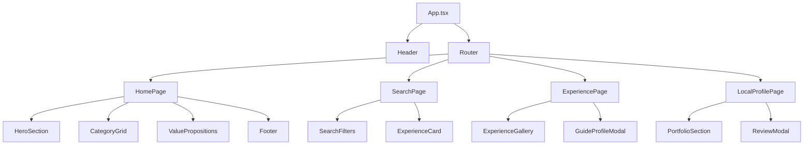

# Technical Architecture

## 1. Architecture Design

```mermaid
graph TD
  U[User Browser] --> F[Frontend (Vite React app)]
  U --> D[DASHBOARD (Vite React app)]

  F -->|HTTP| B[FastAPI Backend]
  D -->|HTTP| B

  B --> DB[(PostgreSQL Database)]

  subgraph "Frontend App"
    F
  end

  subgraph "Dashboard App"
    D
  end

  subgraph "Backend API"
    B
  end

  subgraph "Data Layer"
    DB
  end
```

## 2. Technology Description
- **Frontend app (`frontend/`)**: React@18 + TypeScript + Vite
- **Dashboard app (`dashboard/`)**: React + TypeScript + Vite (separate admin/host/writer UI)
- **Styling**: Tailwind CSS (utility-first)
- **Icons**: Lucide React
- **Routing**: React Router DOM
- **State Management**: React Context + Zustand stores
- **Backend (`backend/`)**: FastAPI + SQLAlchemy + PostgreSQL
- **Build Tooling**: Vite for frontend/dashboard, Docker support for backend

## 3. Route Definitions
| Route | Purpose |
|-------|---------|
| `/` | Homepage with hero section, city grid, and value propositions |
| `/search` | Search results page with filters and experience listings |
| `/experience/:id` | Individual experience details page with booking functionality |
| `/city/:cityName` | City specific landing pages (e.g., /city/kathmandu) |
| `/local/:id` | Local guide profile page with portfolio and contact info |
| `/guides` | Browse local guides directory |
| `/about` | Company information and mission |
| `/contact` | Contact form and support information |

## 4. Component Architecture


## 5. Data Flow
- **Guides & profiles**: Persisted in PostgreSQL via SQLAlchemy `Guide` model and exposed through `/api/v1/public/guides` and `/api/v1/public/guides/{id}`. The frontend consumes these via `frontend/src/services/guidesApi.ts`.
- **Experiences**: Served from backend mock data in `/api/v1/public/experiences` with a schema aligned to the frontend types. This can later be backed by real tables.
- **Authentication**: Handled by `app/api/v1/auth.py` and `AuthService`, with OAuth callbacks for Google and Facebook. Tokens are issued by utility functions in `app/core/security.py`.
- **Client-Side Filtering**: Search and city filters continue to run client-side on top of the API data.
- **Assets**: Images are loaded from Unsplash URLs or from `frontend/public`.
- **Validation**: Backend performs schema validation using Pydantic models; the frontend still applies basic client-side validation for a better UX.

## 6. Performance & Quality
- **Lazy Loading**: Route-based code splitting in both frontend and dashboard.
- **Styling Optimization**: Tailwind purges unused classes in production builds.
- **Type Safety**: TypeScript in all React apps, plus mypy for the backend.
- **Static Analysis**: Ruff (lint) and Black (format) on the backend; ESLint on the React apps.
- **Tests**: Pytest for backend endpoints; CI workflows for frontend, dashboard, and backend ensure type checks and builds run on every push.

## 7. Build Configuration
- **Frontend**: Vite React app under `frontend/` with its own `package.json`, `tsconfig.json`, and `vite.config.ts`.
- **Dashboard**: Separate Vite React app under `dashboard/` with its own tooling.
- **Backend**: Dockerfile and `render.yaml` in `backend/` to deploy the FastAPI service; GitHub Actions workflows run formatting, linting, typings, tests, and readiness checks.
