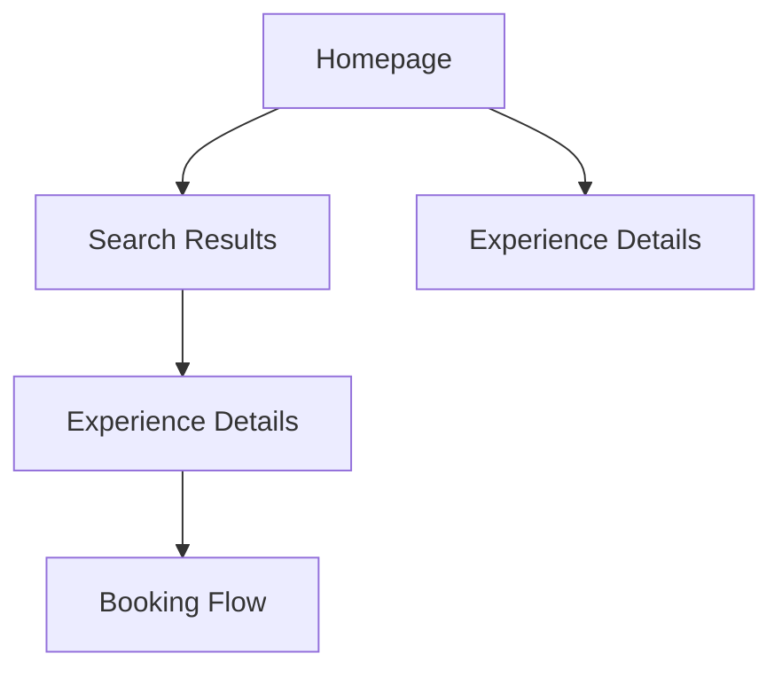

## 1. Product Overview
Guides-Nepal is a travel experience platform that connects travelers with local guides for authentic, private tours and activities. The platform enables travelers to discover unique experiences while supporting local communities.

The product helps travelers find personalized, authentic experiences with local guides, solving the problem of generic tourist activities and providing meaningful cultural connections.

## 2. Core Features

### 2.1 User Roles
| Role | Registration Method | Core Permissions |
|------|---------------------|------------------|
| Traveler | Email registration | Browse experiences, search destinations, view guide profiles, book tours |
| Local Guide | Application approval | Create tour listings, manage availability, communicate with travelers, receive bookings |
| Admin | Internal assignment | Manage users, approve guides, moderate content, handle disputes |

### 2.2 Feature Module
Our travel experience platform consists of the following main pages:
1. **Homepage**: Hero section with search functionality, city grid showcasing destinations, value propositions section, and comprehensive footer.
2. **Search Results**: Filtered experience listings based on destination and preferences.
3. **Experience Details**: Individual tour/experience page with guide information, pricing, and booking options.

### 2.3 Page Details
| Page Name | Module Name | Feature description |
|-----------|-------------|---------------------|
| Homepage | Hero Section | Display search bar with destination input, date picker, and search button. Include background imagery showcasing Nepal destinations. |
| Homepage | City Grid | Showcase popular destinations in Nepal with city cards displaying images and tour counts. Grid layout with hover effects. |
| Homepage | Value Propositions | Display key selling points: "Real People", "Private Experiences", "100% Customizable", "Local Expertise" with supporting icons. |
| Homepage | Footer | Comprehensive footer with company links, destinations, support links, social media, and newsletter signup. |
| Search Results | Filter Panel | Allow filtering by price, duration, category, and guide rating. Update results dynamically. |
| Search Results | Experience Cards | Display tour cards with image, title, duration, price, rating, and brief description. Grid layout with pagination. |
| Experience Details | Hero Gallery | Image carousel showcasing the experience with multiple photos and zoom functionality. |
| Experience Details | Guide Profile | Display guide photo, name, rating, languages spoken, and brief bio. Include contact button. |
| Experience Details | Booking Widget | Price display, date selection, number of travelers, and book now button. Real-time availability checking. |

## 3. Core Process
Users arrive at the homepage and can immediately search for experiences by entering a destination. The hero section provides quick access to popular searches. After searching, users browse filtered results and can click through to detailed experience pages. The booking process flows from experience details to a booking confirmation.

## 4. User Interface Design

### 4.1 Design Style
- **Primary Colors**: Deep orange (#FF6B35) for CTAs, warm grays for text, white backgrounds
- **Button Style**: Rounded corners with subtle shadows, orange primary buttons, white secondary buttons
- **Typography**: Clean sans-serif fonts, 16px base size, clear hierarchy with size variations
- **Layout Style**: Card-based design with generous whitespace, top navigation bar, responsive grid systems
- **Icons**: Minimalist line icons, consistent stroke width, friendly and approachable style

### 4.2 Page Design Overview
| Page Name | Module Name | UI Elements |
|-----------|-------------|-------------|
| Homepage | Hero Section | Full-width hero with search bar centered, overlay text "Find unique experiences with local guides in Nepal", background image of Himalayan landscape, search inputs with rounded borders |
| Homepage | City Grid | 3-column grid on desktop, 2-column on tablet, single column on mobile. Cards with rounded corners, city name overlay, tour count badge. |
| Homepage | Value Propositions | 4-column layout with icon, title, and description. Icons in orange color, consistent spacing between sections. |
| Homepage | Footer | Dark background with white text, 4-column layout with clear section headers, social media icons, newsletter input field. |

### 4.3 Responsiveness
Desktop-first approach with responsive breakpoints at 1200px, 768px, and 480px. Touch interaction optimization for mobile devices with larger tap targets and swipe gestures for image galleries.