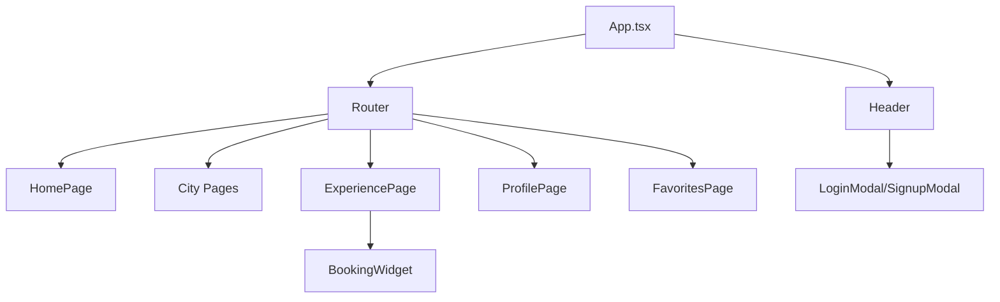

## 1. Architecture Design

```mermaid
graph TD
  A[User Browser] --> B[React Frontend]
  B -->|REST| E[FastAPI Backend]
  E --> F[PostgreSQL]
  E --> G[Static Uploads (/uploads)]
  E --> H[AI Provider (Ollama/OpenAI)]
  B --> C[Static Assets]
  B --> D[Component Library]

  subgraph "Frontend Layer"
      B
      D
      C
  end

  subgraph "Backend Layer"
      E
      F
      G
      H
  end
```

## 2. Technology Description
- Frontend: React 18 + TypeScript + Tailwind CSS + Vite
- State: Zustand for lightweight global state (auth, profile)
- Backend: FastAPI + Pydantic + SQLAlchemy + Alembic
- AI: Ollama (local) and OpenAI (cloud) selectable via env
- Build Tooling: Vite for dev/prod; ESLint and TypeScript checks

## 3. Route Definitions
| Route | Purpose |
|-------|---------|
| / | Homepage with hero section, city grid, and value propositions |
| /search | Search results page with filters and experience listings |
| /experience/:id | Individual experience details page with booking functionality |
| /guides | Browse local guides directory |
| /about | Company information and mission |
| /contact | Contact form and support information |

## 4. Folder Structure
```
src/
├── components/
│   ├── common/
│   │   ├── Header.tsx
│   │   ├── Footer.tsx
│   │   ├── Button.tsx
│   │   └── Card.tsx
│   ├── auth/
│   │   ├── LoginModal.tsx
│   │   └── SignupModal.tsx
│   └── experience/ […]
├── pages/
│   ├── user/
│   │   ├── ProfilePage.tsx
│   │   └── FavoritesPage.tsx
│   ├── kathmandu/ […]
│   ├── lalitpur/ […]
│   ├── pokhara/ […]
│   ├── bharatpur/ […]
│   └── ExperiencePage.tsx
├── store/
│   ├── uiStore.ts
│   ├── authStore.ts
│   └── profileStore.ts
├── data/
│   ├── types.ts
│   ├── *RichData.ts
│   └── guidesData.ts
├── styles/
│   └── globals.css
├── App.tsx
└── main.tsx

backend/
├── app/
│   ├── api/v1/
│   │   ├── profile.py
│   │   ├── ai.py
│   │   └── bookings.py
│   ├── core/
│   ├── models/
│   │   └── bookmark.py
│   ├── schemas/
│   │   └── profile.py
│   ├── services/
│   │   └── bookmark_service.py
│   └── main.py
├── scripts/
│   └── run_checks.sh
├── migrations/
└── requirements.txt
```

## 5. Component Architecture


## 6. Data Flow
- City and experience data sourced from TypeScript modules in `src/data`
- Client-side search with suggestions and navigation via router
- Backend API for profile, bookmarks, uploads, health and AI chat
- Images and static uploads served by FastAPI under `/uploads`
- Profile avatar uploads send multipart to backend; local preview fallback

## 7. Performance Considerations
- Lazy loading for images below the fold
- Code splitting for route-based components
- Optimized image formats (WebP with fallbacks)
- CSS purging with Tailwind to minimize bundle size
- Vite's hot module replacement for fast development

## 8. Build Configuration
- Vite config includes proxy for `/api/v1` to `http://localhost:8000`
- Tailwind CSS enabled via PostCSS
- TypeScript strictness tuned per `tsconfig.json`
- Environment variables documented in README
- Optional: service worker setup for offline functionality

## 9. API Overview
- Base: `/api/v1`
- Profile: `GET /profile/me`, `PATCH /profile/me`, `POST /profile/photos/upload`
- Bookmarks: `GET/POST /profile/bookmarks`, `DELETE /profile/bookmarks/{id}`
- AI: `POST /ai/chat`, `POST /ai/chat/stream`
- Health: `GET /health`
